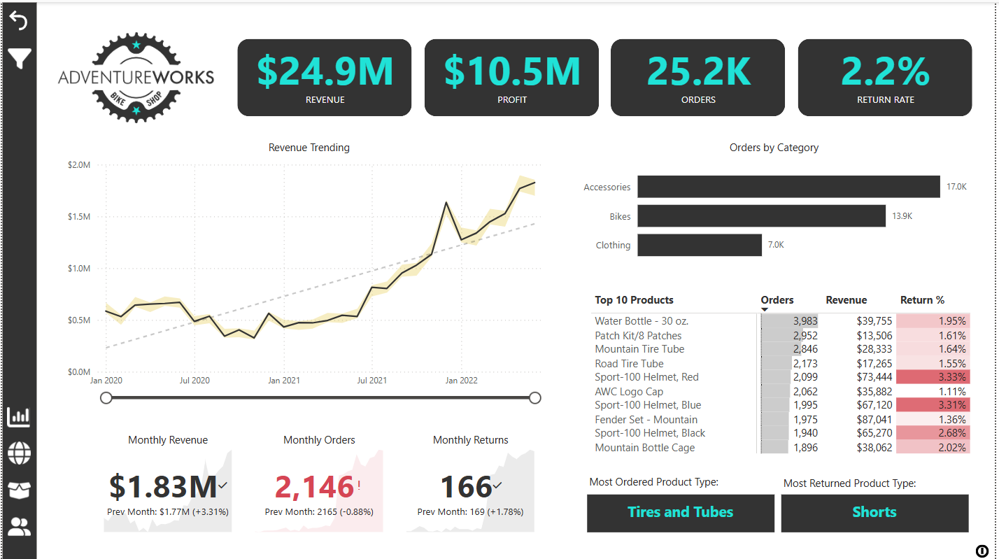

# 🚴 AdventureWorks Sales Performance Dashboard

🔗 **[Live Power BI Dashboard](https://app.powerbi.com/view?r=eyJrIjoiYjZmZjQwMzAtMzlkOC00MWE0LTk2MGEtMDkwMjMxYTNjYjk0IiwidCI6ImM2ZTU0OWIzLTVmNDUtNDAzMi1hYWU5LWQ0MjQ0ZGM1YjJjNCJ9&pageName=ReportSection)**

---

## 📘 Project Overview
This end-to-end Power BI project simulates the role of a Business Intelligence Analyst at AdventureWorks—a global cycling manufacturer. The task involved transforming raw CSVs into an interactive sales dashboard that empowers stakeholders to monitor KPIs, uncover trends, and optimize decision-making.

---

## 🎯 Business Objectives
- Monitor KPIs: Revenue, Profit, Orders, Returns
- Analyze sales trends, returns, and customer behavior
- Compare performance by region, category, and income level
- Identify top-performing products and high-value customers
- Deliver actionable insights through a clean, interactive dashboard

---

## 📊 Key Dashboard Highlights
- 📈 **$24.9M Revenue**, 💰 **$10.5M Profit**, 📦 **25.2K Orders**
- 📊 Revenue trend: **+3.31% MoM**, Returns: **+1.78% MoM**
- 🧢 Top 10 Products: Orders, Revenue, Return %
- 👥 Customer Intelligence: 17.4K Unique Customers, $1,431 per customer
- 🌎 Geography: Sales by country, region, and territory
- 🎯 Target tracking: Revenue, Orders, and Profit vs. Goals

---

## 🔧 Skills Demonstrated

- **Connecting & Shaping Data** using Power Query
- **Data Cleaning & Profiling** with column quality, transformation, and conditional rules
- **Relational Data Modeling** with star and snowflake schemas
- **Table Relationships** built using primary/foreign keys and cardinality control
- **Calculated Fields with DAX**: Measures, Iterators, Time Intelligence
- **Interactive Data Visualization**: Charts, Cards, Slicers, Drill-throughs, Tooltips
- **Dashboards** designed for executive summaries and deep-dive analysis
- **AI Features**: Key Influencers, Smart Narratives, Anomaly Detection
- **Performance Analysis**: Target vs Actual, rolling averages, filters
- **Power BI Optimization Tools**: Performance Analyzer, Optimize Ribbon, Slicer Sync
- **Documentation & Report UX**: Layout design, drill navigation, bookmarks
- **Power BI Desktop Proficiency**: End-to-end workflow from ETL to published report

---

## 🛠️ Tools & Technologies
- Power BI Desktop  
- Power Query  
- DAX  
- CSV (raw data files)  
- Microsoft Power BI Service (for publishing)

