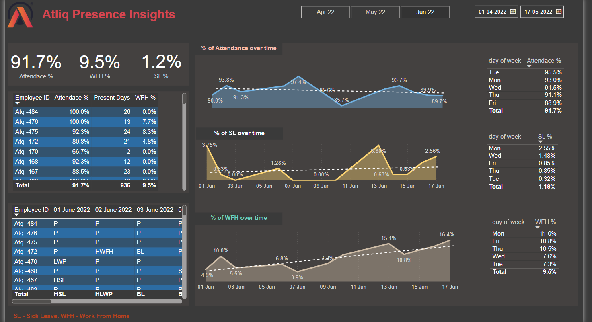

# Atliq Presence Insights Dashboard

## Overview
Atliq Presence Insights is a Power BI dashboard designed to track and analyze employee attendance patterns over a fiscal year, which starts from April and ends in March. The dashboard provides valuable insights into attendance percentages, work-from-home trends, and sick leave occurrences across different timeframes. The available data spans three months: **April, May, and June**.

### 📊 you can access the  Power BI web Report from the below link
[View AtliQ Presence Insights Report](https://app.powerbi.com/view?r=eyJrIjoiNWVlZmYwNzAtZmJmMy00NWJmLThiNGUtMGI3MGZjMzRmNWVkIiwidCI6ImM2ZTU0OWIzLTVmNDUtNDAzMi1hYWU5LWQ0MjQ0ZGM1YjJjNCJ9)
## Purpose
The primary objective of this dashboard is to:
- Monitor overall **attendance percentage** of employees.
- Track the percentage of employees working from home (**WFH %**) and on sick leave (**SL %**).
- Understand attendance trends **over time** (weekly and monthly).
- Identify **working preferences** between on-site presence and remote work.
- Analyze attendance behavior by **day of the week**.
- Provide insights on various **leave types** such as Paid Leave (PL), Leave Without Pay (LWP), and more.

## Key Metrics
- **Attendance %:** Displays the percentage of employees present in the office.
- **WFH %:** Tracks the proportion of employees working from home.
- **SL %:** Monitors the percentage of employees on sick leave.
- **% of Attendance over time:** A time-series representation of attendance patterns across months.
- **% of SL over time:** Displays trends in sick leave taken by employees.
- **% of WFH over time:** Shows work-from-home trends across different timeframes.
- **Attendance by Day of the Week:** Highlights attendance fluctuations based on weekdays.
- **SL by Day of the Week:** Identifies trends in sick leave based on weekdays.
- **WFH by Day of the Week:** Analyzes work-from-home patterns for different days.

## Data Scope
- **Time Period:** April 2022 - June 2022
- **Fiscal Year:** April - March
- **Employee Attendance Records:** Includes multiple attendance statuses such as Present (P), Work From Home (WFH), Sick Leave (SL), Paid Leave (PL), and more.
- **Employee ID-Level Tracking:** Attendance data is logged for individual employees.

## Attendance Key
The dashboard leverages different attendance categories, including:
- **P** - Present
- **WFH** - Work From Home
- **SL** - Sick Leave
- **PL** - Paid Leave
- **LWP** - Leave Without Pay
- **BL** - Birthday Leave
- **BRL** - Bereavement Leave
- **FFL** - Floating Festival Leave
- **ML** - Menstrual Leave
- **HSL** - Half-day Sick Leave
- **HML** - Half-day Menstrual Leave
- And more...

## Insights & Use Cases
- Helps **HR and management** to assess attendance trends and strategize workforce planning.
- Identifies employees' **working preferences** (on-site vs. remote work).
- Assists in understanding leave patterns, enabling better **resource allocation**.
- Supports data-driven decision-making regarding **attendance policies**.

## challenges:
- merging data from different worksheet  into single excel workbook using Power BI. So I have solved this with the help of Google, The Art of googling is so importanat. Here is the reference below with helped me. [link](https://blog.crossjoin.co.uk/2018/07/09/power-bi-combine-multiple-excel-worksheets/)

## Future requirements
- We can add sending alerts to emails, based on some conditions ex: if attendance% is below certain number, and many more.
- we can set automatic data refresh with certain interval of time, so that we can get the accurate visuals.
- setting security level for data like Access Privileges to restrict access to certain level of employees.

## Conclusion
The Atliq Presence Insights dashboard serves as a **comprehensive attendance tracking tool**, enabling organizations to gain a deeper understanding of workforce behavior. By leveraging this data, businesses can optimize their HR policies and improve overall employee engagement and productivity.

