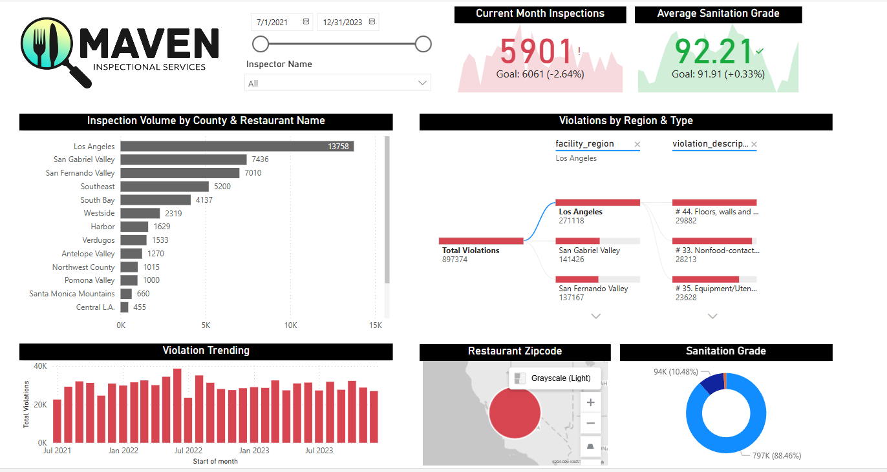

# 🏥 Maven Inspectional Services – Restaurant Health Dashboard

> ⚠️ *Disclaimer: The live Power BI dashboard link is not included as the Microsoft Fabric trial has expired. A new link will be added once the workspace is reactivated.*

> ⚠️ **Note**: While the dashboard may appear simple at first glance, the true value of this project lies in exploring **core enterprise-grade Power BI Service features**. It demonstrates the complete workflow using components like **Microsoft Fabric**, **data gateways**, **row-level security (RLS)**, **semantic models**, **scheduled refresh**, **alerts**, **mobile layouts**, and **DAX-driven KPIs**. The focus is not on visual complexity but on mastering essential service-level capabilities for scalable reporting solutions.

---

## 📘 Project Overview

This Power BI Service project simulates a real-world reporting solution for **Maven Inspectional Services**, a fictional health inspection agency based in Los Angeles. The goal was to build a fully cloud-based business intelligence system that connects raw inspection data to Power BI Service, models it into reusable dataflows and semantic models, and creates shareable dashboards with row-level security (RLS) and automated alerts.

---

## 🎯 Business Objectives

- Analyze restaurant inspection data across 15+ LA regions
- Track key performance indicators: inspection volume, violation types, sanitation grades
- Automate scheduled refresh via **dataflows**
- Implement **Row-Level Security** to control access by inspector or region
- Pin visuals and live report pages to build **interactive dashboards**
- Enable **alerts**, mobile layouts, and natural language Q&A exploration

---

## 📊 Dashboard Highlights

- ✅ **Current Month Inspections**: 5,901 vs. Goal: 6,061  
- 🧼 **Average Sanitation Grade**: 92.21  
- 📍 **Inspection Volume by County & Restaurant**  
- ⚠️ **Violations by Type and Region**  
- 📌 **Zip Code-level Heatmaps using Azure Maps**  
- 🔄 Drill-through filters and slicers for time range, inspectors, and grade type  
- 🔒 **RLS applied** to restrict regional data views for individual users  

---

## 🔧 Skills Demonstrated

- **Power BI Service**: Workspaces, dashboards, semantic models
- **Power Query (in cloud)**: Dataflows and transformations
- **Row-Level Security (RLS)**: Static and dynamic roles with `USERPRINCIPALNAME()`
- **Data Modeling**: Star schema with proper key relationships
- **DAX Measures**: Total Inspections, Grade A/B/C, % Violations, Time Intelligence
- **Scheduled Refresh**: For both dataflows and semantic models
- **Alerts & Q&A**: Threshold alerts, natural language search
- **Mobile Layouts**: Optimized for Power BI mobile app
- **Collaboration & Sharing**: Publish as app, workspace-level sharing

---

## 🛠️ Tools & Technologies

- Power BI Service (cloud)
- Power Query (dataflows)
- DAX
- Azure Maps Visuals
- Gateways (for local file setup)
- Semantic Models & RLS
- Microsoft Fabric Integration
- Power BI Desktop (initial publishing)

