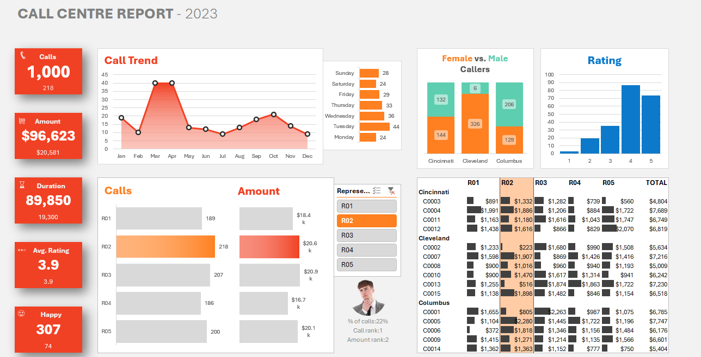

# Call Center Performance Dashboard

In this project, I have built an **interactive Call Center Performance Dashboard** to analyze and visualize key metrics such as calls, durations, ratings, and revenue. This project demonstrates how I leveraged Excel's powerful features like Data Models, Power Pivot, and DAX to create dynamic and visually appealing dashboards.

---

## **Project Overview**

This project focuses on:
- Designing a custom dashboard layout, including color themes and fonts.
- Connecting and managing datasets using the **Data Model** feature of Excel.
- Creating **KPIs** and calculations with **Power Pivot** and **DAX**.
- Building **Pivot Tables** for dynamic data summaries.
- Using slicers to make charts and tables interactive.
- Applying **Conditional Formatting** to enhance data visualizations.
- Incorporating **XLOOKUP** and images to show dynamic pictures based on user selection.

---

## **What I learnt**
- **Dashboard Design**:
  - Creating an engaging layout with custom colors and fonts.
- **Data Modeling**:
  - I used Excel's **Data Model** to create relationships between multiple datasets.
- **Power Pivot and DAX**:
  - I have Created calculated fields and measures for KPIs like average ratings, total calls, and revenue.
- **Pivot Tables and Charts**:
  - Summarized data dynamically and visualize it with interactive slicers and charts.
- **Conditional Formatting**:
  - Highlighting trends using formatted data bars and color scales.
- **Dynamic Images**:
  - Display pictures that change based on slicer selection using **XLOOKUP**.

---

## **Key Features of the Dashboard**
1. **KPI Tiles**: Visual tiles display key metrics like total calls, revenue, duration, and satisfaction ratings.
2. **Interactive Trend Charts**: Analyze call trends over time and day-wise distribution.
3. **Representative Performance**: Compare call volumes and amounts across representatives.
4. **Customer Insights**: Break down performance by customer demographics like gender, age, and city.
5. **Dynamic Tables**: View customer-level revenue and ratings with data-driven highlights.
   
---

## **Tools Used**
- **Excel**:
  - Power Query
  - Power Pivot
  - Pivot Tables and Charts
- **DAX (Data Analysis Expressions)**:
  - For creating calculated fields and measures.
- **Conditional Formatting**:
  - Enhance the visuals with data-driven styling.
- **XLOOKUP**:
  - Dynamically display representative pictures.

