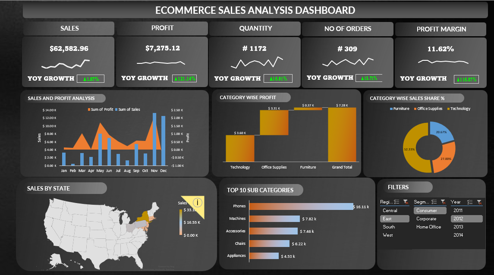

## Overview
This dashboard provides an in-depth analysis of **Ecommerce sales performance**, showcasing key performance indicators (KPIs) and dynamic insights through various visual elements.

---

## Key KPIs
- **Sales**: Total revenue generated.
- **Profit**: Net profit from sales.
- **Quantity**: Total number of products sold.
- **Number of Orders**: Total orders placed.
- **Profit Margin**: Percentage of profit relative to sales.
- **Year-over-Year (YoY) Growth**: Growth trends for all KPIs.

---

## Dashboard Components

### 1. Sales and Profit Analysis
- Displays **monthly trends** of sales and profit.
- Uses **combination charts** for easy comparison.

### 2. Category-Wise Profit
- Shows **profit distribution** across different product categories.

### 3. Category-Wise Sales Share %
- A **pie chart** representing sales share among major categories.

### 4. Sales by State
- A **custom heatmap** indicating sales distribution across different states.

### 5. Top 10 Sub-Categories
- Highlights the **highest-selling subcategories** with horizontal bar charts.

### 6. Filters
- **Region**: Filters data based on geographical regions.
- **Segment**: Consumer, Corporate, and Home Office segments.
- **Year**: Allows selection of specific years to analyze trends.

---

## Dynamic Interactions
- **Charts and values update dynamically** based on selected filters.
- **Interactive elements** improve data exploration and insights.

---

## Key Techniques Used
- **Waterfall Charts**
- **Custom Filters & Interactions**
- **Calculated Fields for Metrics**
- **Layout Optimization**
- **Custom Charts & Maps**
- **Advanced Formatting for Maps**
- **YoY Growth Calculation**
- **Sparklines for Trend Visualization**

---

This dashboard is designed for **business analysts, sales teams, and decision-makers** to track performance and identify trends effectively.
